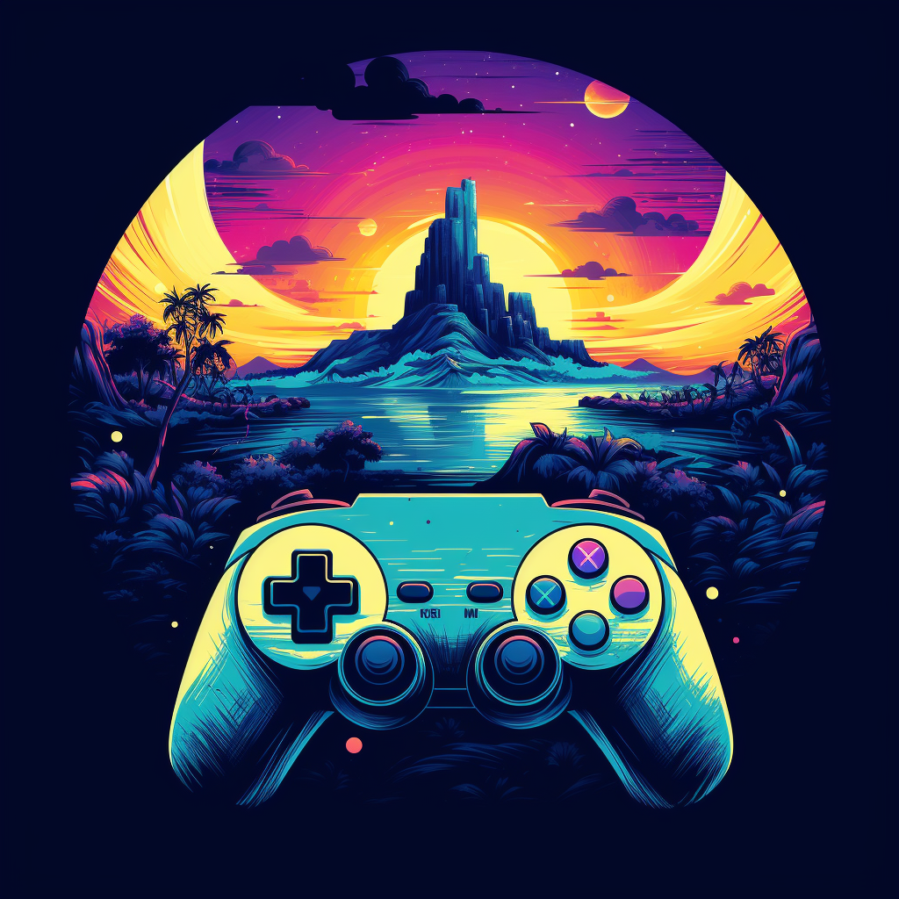

## Video Game Archive

<h1 align="center">
    
</h1>

A fully modern React App that utilizes a RAWG API to retrieve a list of all available video games.
• React Query for global state management
• Dark mode for visual presentation
• Able to filter games by platforms and genres
• Sort games by relevance, alphabetical order, date etc.
• Fully responsive for desktop or mobile viewing
• Search any video game title
• More information and images are displayed when selecting a video game
